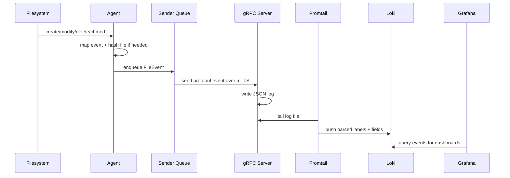

# FIM

FIM is a distributed File Integrity Monitoring project written in Go. It consists of a lightweight endpoint agent that watches the filesystem, computes hashes for relevant files, and streams structured events to a central gRPC server secured with mutual TLS. The server emits JSON logs that are collected by Promtail, stored in Loki, and visualized in Grafana.

The current implementation already covers the full end-to-end event pipeline:

- local file monitoring
- baseline file scan on startup
- SHA-256 hashing with retry logic
- buffered event delivery over gRPC
- mutual TLS authentication between agent and server
- structured log shipping into Loki
- a pre-provisioned Grafana security dashboard

## What This Project Does

The goal is to answer questions such as:

- What file changed?
- When did it change?
- Was it created, modified, deleted, or chmod-ed?
- What is the file hash after the change?
- Which host generated the event?

## Repository Layout

```text
.
|-- agent/                  Agent-side watcher, scanner, hashing, transport
|   |-- network/            TLS and gRPC sender logic
|-- cmd/
|   |-- agent/              Agent entrypoint
|   |-- server/             Central server entrypoint
|-- config/                 Agent configuration
|-- certs/                  CA, server, and client certificates
|-- proto/                  Protobuf and generated gRPC types
|-- deploy/                 Docker Compose + Loki/Promtail/Grafana assets
|-- Dockerfile.server       Root server container build
```

## Architecture

```mermaid
flowchart LR
    A[Filesystem Activity] --> B[Agent Watcher]
    B --> C[Hash + Metadata Builder]
    C --> D[Buffered Sender Queue]
    D --> E[gRPC Stream over mTLS]
    E --> F[Central Server]
    F --> G[JSON Structured Logs]
    G --> H[Promtail]
    H --> I[Loki]
    I --> J[Grafana Dashboard]
```



### Component Roles

#### Agent

The agent is responsible for:

- loading YAML configuration
- resolving agent identity from the hostname when `agent.id: auto`
- recursively or non-recursively watching configured directories
- skipping excluded files and directories
- running a baseline scan at startup
- hashing created/modified/scanned files
- queueing events locally
- reconnecting to the server indefinitely after disconnects

#### Server

The server is responsible for:

- listening on TCP `:9000`
- enforcing client certificate authentication
- receiving a client-streaming gRPC event stream
- writing received events as JSON logs

#### Observability Stack

The deployment stack adds:

- Promtail to parse server JSON logs
- Loki to store and query log events
- Grafana to visualize recent FIM activity

## End-to-End Logic

### 1. Agent startup

When `cmd/agent/main.go` starts, it:

1. loads `config/gowatch.yaml`
2. resolves the agent ID from the local hostname if configured as `auto`
3. initializes the network sender with a buffered queue of `1000` events
4. starts the sender loop in a goroutine
5. creates the filesystem watcher
6. starts a baseline scan in a goroutine
7. begins consuming live filesystem events until interrupted

### 2. Baseline scanning

At startup, `ScanExistingFiles` walks every configured watch root and emits a `FILE_SCAN` event for each non-excluded file.

Baseline scan behavior:

- walks every configured path with `filepath.WalkDir`
- skips excluded directories with `filepath.SkipDir`
- hashes eligible files with SHA-256
- emits one event per file with timestamp, hostname, OS, file path, and new hash

This gives the backend an initial view of the monitored file set before live changes arrive.

### 3. Live filesystem watching

The watcher uses `fsnotify` and maps native events into the shared protobuf enum:

- `Create` -> `FILE_CREATE`
- `Write` -> `FILE_MODIFY`
- `Remove` -> `FILE_DELETE`
- `Chmod` -> `CHANGE_PERMISSION`
- `Rename` is currently ignored and becomes `UNKNOWN`

Important watcher logic:

- recursive mode adds every discovered directory at startup
- newly created directories are added dynamically so recursive monitoring continues after boot
- events on the same path are debounced for `500ms`
- excluded names are filtered using `filepath.Match` against the basename only
- hashes are computed only for `FILE_CREATE` and `FILE_MODIFY`

### 4. Hashing logic

Hash calculation uses SHA-256 and is intentionally defensive:

- files larger than the configured maximum size are skipped
- the agent retries file access up to 3 times
- each retry waits `500ms`
- this helps when files are briefly locked by another process

The current default maximum file size is `50 MB` if it is omitted from config.

### 5. Event buffering and reconnect behavior

The sender maintains an in-memory buffered channel:

- queue capacity is `1000` events
- enqueue is non-blocking
- if the queue is full, the event is dropped and a warning is logged
- if sending fails, the current event is re-enqueued before reconnecting
- reconnect attempts happen every `5s` until the server is available again

This design prioritizes agent stability and continued operation over guaranteed delivery.

## Event Schema

The event contract is defined in `proto/event.proto`.

### Event types

- `UNKNOWN`
- `FILE_CREATE`
- `FILE_DELETE`
- `FILE_MODIFY`
- `CHANGE_PERMISSION`
- `FILE_SCAN`

### Fields currently sent by the agent

```text
hostname
os
file_path
event_type
new_hash
timestamp
```

## Network Design

### Transport

- protocol: gRPC
- RPC shape: client-streaming
- listening address: `:9000`
- message format: protobuf

The agent opens a single long-lived stream and continuously sends `FileEvent` messages. When the agent shuts down cleanly, it closes the stream and expects an `Ack`.

### Network flow



## Security Model

Security in the current codebase is centered on mutual TLS for the agent-to-server channel.

### What is protected

- encryption in transit between agent and server
- server authentication to the agent
- agent authentication to the server
- rejection of clients without a trusted certificate

### How mTLS is implemented

The agent:

- loads a client certificate and key
- loads the CA certificate into a trust pool
- uses TLS transport credentials for the gRPC client

The server:

- loads a server certificate and key
- loads the CA certificate into `ClientCAs`
- sets `ClientAuth: tls.RequireAndVerifyClientCert`
- refuses connections from clients without a valid CA-signed certificate

### Certificate files expected by the code

Agent config references:

- `certs/ca.crt`
- `certs/client.crt`
- `certs/client.key`

Server startup loads:

- `certs/ca.crt`
- `certs/server.crt`
- `certs/server.key`

### How to generate the certificates

These certificates are intended to live locally in `certs/` for development/testing and are already excluded by `.gitignore`. If you want to recreate them from scratch, the following OpenSSL flow matches the filenames expected by the code.

First create the certificate directory:

```bash
mkdir -p certs
```

Create the local CA:

```bash
openssl genrsa -out certs/ca.key 2048
openssl req -x509 -new -nodes -key certs/ca.key -sha256 -days 3650 -out certs/ca.crt -subj "/CN=FIM-Local-CA"
```

Create the server certificate:

```bash
openssl genrsa -out certs/server.key 2048
openssl req -new -key certs/server.key -out certs/server.csr -subj "/CN=localhost"
openssl x509 -req -in certs/server.csr -CA certs/ca.crt -CAkey certs/ca.key -CAcreateserial -out certs/server.crt -days 825 -sha256
```

Create the client certificate:

```bash
openssl genrsa -out certs/client.key 2048
openssl req -new -key certs/client.key -out certs/client.csr -subj "/CN=fim-agent"
openssl x509 -req -in certs/client.csr -CA certs/ca.crt -CAkey certs/ca.key -CAcreateserial -out certs/client.crt -days 825 -sha256
```

After generation, the directory should contain:

- `certs/ca.crt`
- `certs/ca.key`
- `certs/ca.srl`
- `certs/server.crt`
- `certs/server.csr`
- `certs/server.key`
- `certs/client.crt`
- `certs/client.csr`
- `certs/client.key`

Important notes:

- the server trusts only client certificates signed by `certs/ca.crt`
- the agent trusts only servers signed by `certs/ca.crt`
- for real deployments, replace the simple `CN=localhost` example with hostnames or SANs that match your actual server address
- keep `*.key` files local and private; this repository already ignores `certs/` in `.gitignore`
- if you rotate the CA, both server and client certificates must be reissued

## Configuration

Current example config:

```yaml
agent:
  id: auto

server:
  address: localhost:9000
  tls: true
  ca_cert: certs/ca.crt
  client_cert: certs/client.crt
  client_key: certs/client.key

watch:
  paths:
    - ./test-watch
  recursive: true
  max_file_size_mb: 50
  exclude:
    - ".git"
    - ".*tmp"
    - ".*log"

events:
  include:
    - FILE_CREATE
    - FILE_MODIFY
    - FILE_DELETE
    - CHANGE_PERMISSION

scan:
  on_reconnect: true
```

## Observability Stack

The `deploy/` directory provisions a basic security telemetry pipeline.

### Docker Compose services

- `fim-server`
- `loki`
- `promtail`
- `grafana`

### Exposed ports

- `9000` -> FIM gRPC server
- `3100` -> Loki HTTP API
- `3000` -> Grafana UI

### Log flow

1. the Go server writes JSON logs to stdout and optionally to `/var/log/fim/fim.log`
2. Promtail tails `/var/log/fim/*.log`
3. Promtail parses JSON fields such as `hostname`, `action`, `file_path`, and `hash`
4. Promtail promotes `action` and `hostname` into Loki labels
5. Grafana queries Loki and renders the dashboard

### Dashboard panels

The bundled Grafana dashboard currently shows:

- total file events in the last hour
- action breakdown by event type
- per-minute event velocity
- real-time security event logs

## Running the Project

### Prerequisites

- Go `1.24.x` for local builds
- valid CA, server, and client certificates in `certs/`
- reachable network path between agent and server

### Run the server locally

```bash
go run ./cmd/server
```

### Run the agent locally

```bash
go run ./cmd/agent
```

### Run the observability stack

From `deploy/`:

```bash
docker compose up --build
```

## Stability choices

The agent uses several defensive choices to avoid destabilizing monitored endpoints:

- non-blocking queue enqueue
- retry-based file opening for transient locks
- max file size cap for expensive hashing
- debounce window to reduce duplicate bursts
- graceful shutdown through context cancellation


## Summary

FIM already provides a working secure telemetry path for file integrity events:

`filesystem -> agent -> buffered queue -> mTLS gRPC -> JSON logs -> Promtail -> Loki -> Grafana`

